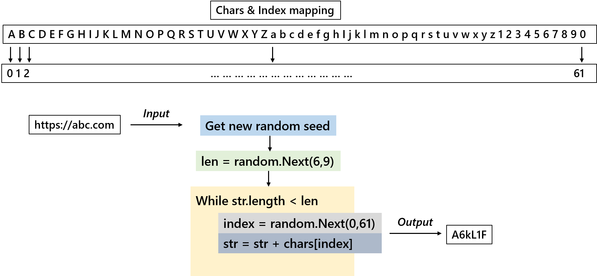

# Azure Functions
This folder contains source code for the functions written in C#.

## 1. Generate Short URL
This function generate unique identifier for a long url, and it supports 2 mode, either with own alias, or auto generated. Once generated, it will create a new item in Cosmos DB. For random generator, it will check for duplication and re-run if duplication found.

Here's the flow on how it gets generated:

## 2. Get Full URL
This is to query the full url based on supplied alias. It simplies query from Cosmos DB.